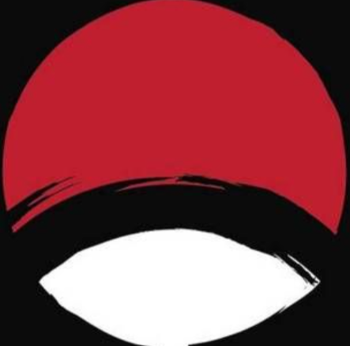

<!-- Improved compatibility of back to top link: See: https://github.com/othneildrew/Best-README-Template/pull/73 -->

<a id="readme-top"></a>

<!-- PROJECT LOGO -->
<br />
<div align="center">
  <a href="https://github.com/SimpleCyber/anime-recommendation-system">
    
  </a>

  <h3 align="center">Anime Hub</h3>

  <p align="center">
    An awesome Anime Recommendation System to jumpstart your next binge!
    <br />
    <a href="https://github.com/SimpleCyber/anime-recommendation-system"><strong>Explore the docs »</strong></a>
    <br />
    <br />
    <a href="https://anime-recccc.vercel.app/">View Demo</a>
    &middot;
    <a href="https://github.com/SimpleCyber/anime-recommendation-system/issues/new?labels=bug&template=bug-report---.md">Report Bug</a>
    &middot;
    <a href="https://github.com/SimpleCyber/anime-recommendation-system/issues/new?labels=enhancement&template=feature-request---.md">Request Feature</a>
  </p>
</div>

<!-- TABLE OF CONTENTS -->
<details>
  <summary>Table of Contents</summary>
  <ol>
    <li>
      <a href="#about-the-project">About The Project</a>
      <ul>
        <li><a href="#built-with">Built With</a></li>
      </ul>
    </li>
    <li>
      <a href="#getting-started">Getting Started</a>
      <ul>
        <li><a href="#prerequisites">Prerequisites</a></li>
        <li><a href="#installation">Installation</a></li>
      </ul>
    </li>
    <li><a href="#usage">Usage</a></li>
    <li><a href="#roadmap">Roadmap</a></li>
    <li><a href="#contributing">Contributing</a></li>
    <li><a href="#license">License</a></li>
    <li><a href="#contact">Contact</a></li>
    <li><a href="#acknowledgments">Acknowledgments</a></li>
  </ol>
</details>

<!-- ABOUT THE PROJECT -->

## About The Project

[![Product Name Screen Shot][product-screenshot]](https://anime-recccc.vercel.app/)

Anime Hub is a dynamic and modern Anime Recommendation System designed to help you discover, explore, and save your favorite anime shows. Built with a sleek user interface inspired by HiAnime, the platform features trending sections, multi-category grids, and a spotlight hero carousel.

With integration to the TMDB API, it brings you real-time information on top-airing, most popular, and latest anime. You can search across a massive database, save your favorites using Firebase backend integration, and customize your user profile.

### Demographic Recommendation Model

Anime Hub utilizes a purely demographic-based recommendation system to suggest anime tailored to each user. Instead of relying solely on global popularity or generic genres, our custom algorithm analyzes your profile details (such as **Age, State, and Country**) and compares them against the entire user base over our Firebase backend.

By employing **Nearest Neighbor** and **Similarity Scoring** methodologies, the system groups users into a network based on shared backgrounds. It then calculates an accrued weight corresponding to the movies saved by your most similar peers, resulting in a personalized "Recommended For You" carousel. This custom engine ensures you can discover relevant anime effectively based entirely on demographic clustering.

<p align="right">(<a href="#readme-top">back to top</a>)</p>

### Built With

- [![React][React.js]][React-url]
- [![Vite][Vite.js]][Vite-url]
- [![TailwindCSS][TailwindCSS.com]][TailwindCSS-url]
- [![Firebase][Firebase.com]][Firebase-url]
- [![GSAP][GSAP.com]][GSAP-url]

<p align="right">(<a href="#readme-top">back to top</a>)</p>

<!-- GETTING STARTED -->

## Getting Started

To get a local copy up and running, follow these simple steps.

### Prerequisites

- npm
  ```sh
  npm install npm@latest -g
  ```

### Installation

1. Get a free API Key at [https://www.themoviedb.org/](https://www.themoviedb.org/)
2. Clone the repo
   ```sh
   git clone https://github.com/SimpleCyber/anime-recommendation-system.git
   ```
3. Install NPM packages
   ```sh
   npm install
   ```
4. Enter your API in `.env`
   ```js
   VITE_TMDB_API_KEY = your_api_key_here;
   ```
5. Run the development server
   ```sh
   npm run dev
   ```

<p align="right">(<a href="#readme-top">back to top</a>)</p>

<!-- USAGE EXAMPLES -->

## Usage

Anime Hub offers an intuitive interface where you can:

- **Discover**: Browse the Spotlight Hero section and daily Trending lists.
- **Search**: Use the debounced search bar to instantly find any anime using the TMDB database.
- **Save**: Keep track of the shows you love by saving them directly to your collection.
- **Profile**: Customize your user avatar, location, and other preferences syncing through Firebase.

_For a live example, please refer to our [Live Demo](https://anime-recccc.vercel.app/)_

<p align="right">(<a href="#readme-top">back to top</a>)</p>

<!-- ROADMAP -->

## Roadmap

- [x] Initial UI Design & layout setup
- [x] TMDB API Integration for real-time anime queries
- [x] Integrate Firebase for saved anime and user preferences
- [ ] Add Multi-language Support
  - [ ] Spanish
  - [ ] Japanese
- [ ] Implement robust user authentication

See the [open issues](https://github.com/SimpleCyber/anime-recommendation-system/issues) for a full list of proposed features (and known issues).

<p align="right">(<a href="#readme-top">back to top</a>)</p>

<!-- CONTRIBUTING -->

## Contributing

Contributions are what make the open source community such an amazing place to learn, inspire, and create. Any contributions you make are **greatly appreciated**.

If you have a suggestion that would make this better, please fork the repo and create a pull request. You can also simply open an issue with the tag "enhancement".
Don't forget to give the project a star! Thanks again!

1. Fork the Project
2. Create your Feature Branch (`git checkout -b feature/AmazingFeature`)
3. Commit your Changes (`git commit -m 'Add some AmazingFeature'`)
4. Push to the Branch (`git push origin feature/AmazingFeature`)
5. Open a Pull Request

<p align="right">(<a href="#readme-top">back to top</a>)</p>

<!-- LICENSE -->

## License

Distributed under the Unlicense License. See `LICENSE` for more information.

<p align="right">(<a href="#readme-top">back to top</a>)</p>

<!-- CONTACT -->

## Contact

SimpleCyber - [@SimpleCyber](https://github.com/SimpleCyber)

Project Link: [https://github.com/SimpleCyber/anime-recommendation-system](https://github.com/SimpleCyber/anime-recommendation-system)

<p align="right">(<a href="#readme-top">back to top</a>)</p>

<!-- ACKNOWLEDGMENTS -->

## Acknowledgments

- [TMDB API](https://www.themoviedb.org/documentation/api)
- [Anime Hub Design Inspiration](https://hianime.to/)
- [Phosphor Icons / Lucide React](https://lucide.dev/)
- [TailwindCSS Components](https://tailwindcss.com/)

<p align="right">(<a href="#readme-top">back to top</a>)</p>

<!-- MARKDOWN LINKS & IMAGES -->
<!-- https://www.markdownguide.org/basic-syntax/#reference-style-links -->

[contributors-shield]: https://img.shields.io/github/contributors/SimpleCyber/anime-recommendation-system.svg?style=for-the-badge
[contributors-url]: https://github.com/SimpleCyber/anime-recommendation-system/graphs/contributors
[forks-shield]: https://img.shields.io/github/forks/SimpleCyber/anime-recommendation-system.svg?style=for-the-badge
[forks-url]: https://github.com/SimpleCyber/anime-recommendation-system/network/members
[stars-shield]: https://img.shields.io/github/stars/SimpleCyber/anime-recommendation-system.svg?style=for-the-badge
[stars-url]: https://github.com/SimpleCyber/anime-recommendation-system/stargazers
[issues-shield]: https://img.shields.io/github/issues/SimpleCyber/anime-recommendation-system.svg?style=for-the-badge
[issues-url]: https://github.com/SimpleCyber/anime-recommendation-system/issues
[license-shield]: https://img.shields.io/github/license/SimpleCyber/anime-recommendation-system.svg?style=for-the-badge
[license-url]: https://github.com/SimpleCyber/anime-recommendation-system/blob/main/LICENSE
[linkedin-shield]: https://img.shields.io/badge/-LinkedIn-black.svg?style=for-the-badge&logo=linkedin&colorB=555
[linkedin-url]: https://linkedin.com/in/your_linkedin
[product-screenshot]: public/readme/hero.png
[React.js]: https://img.shields.io/badge/React-20232A?style=for-the-badge&logo=react&logoColor=61DAFB
[React-url]: https://reactjs.org/
[TailwindCSS.com]: https://img.shields.io/badge/Tailwind_CSS-38B2AC?style=for-the-badge&logo=tailwind-css&logoColor=white
[TailwindCSS-url]: https://tailwindcss.com/
[Firebase.com]: https://img.shields.io/badge/Firebase-FFCA28?style=for-the-badge&logo=firebase&logoColor=black
[Firebase-url]: https://firebase.google.com/
[Vite.js]: https://img.shields.io/badge/Vite-646CFF?style=for-the-badge&logo=vite&logoColor=white
[Vite-url]: https://vitejs.dev/
[GSAP.com]: https://img.shields.io/badge/GSAP-88CE02?style=for-the-badge&logo=greensock&logoColor=white
[GSAP-url]: https://greensock.com/
